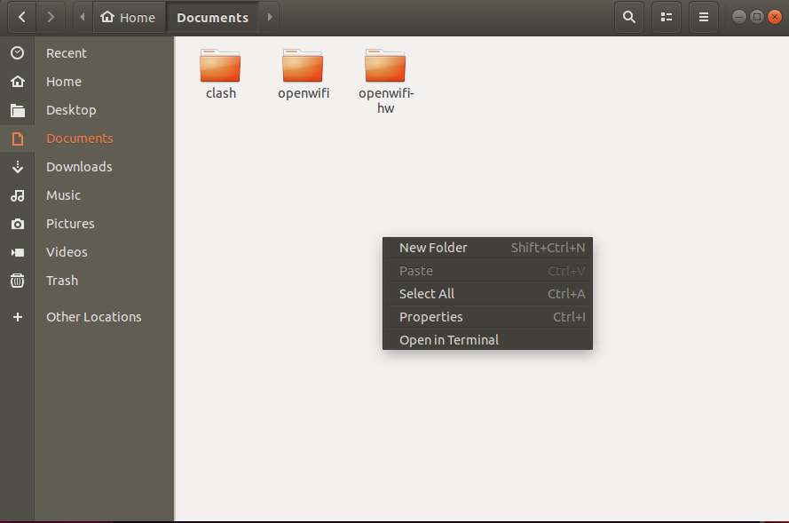

<!--
 * @Author: ZY
 * @Date: 2024-07-11 00:35:14
 * @LastEditors: thezhangy937 2549867105@qq.com
 * @LastEditTime: 2024-07-11 01:36:05
 * @FilePath: \OpenWifi\Readme.md
 * @Description: 
 * 
 * Copyright (c) 2024 by ${git_name_email}, All Rights Reserved. 
-->
# OpenWifi 工程说明文档

 ##### 虚拟机说明：
 1. 虚拟机镜像使用VMware® Workstation 17 Pro，版本17.5.0 build-22583795，其中已经按照openwifi-hw开源工程要求，安装编译所需的Ubuntu18.04系统，Vivado2021软件以及各种所需的软件包。环境变量如下：
```
//虚拟机登录账号为Panda，密码为admin
//板子类型目前还是使用antsdr ，后期看看要怎么改成e310v2

export XILINX_DIR=/home/Vivado2021
export BOARD_NAME=antsdr 
export OPENWIFI_HW_IMG_DIR=~/Documents/openwifi-hw
```
 ##### openwifi-hw编译说明：
使用这些环境变量即可完成openwifi-hw部分的工程创建和编译,以下代码如果不切换板子，只需要运行一次即可，之后可直接打开vivado操作
```
cd OPENWIFI_HW_IMG_DIR
./prepare_adi_lib.sh $XILINX_DIR
./prepare_adi_board_ip.sh $XILINX_DIR $BOARD_NAME
./get_ip_openofdm_rx.sh
cd ~/Documents/openwifi-hw/boards/$BOARD_NAME/
../create_ip_repo.sh $XILINX_DIR
\\在弹出的vivado窗口中，找到底下的tcl窗口，输入
source ./openwifi.tcl
```
然后在vivado软件左边直接点击Generate Bitstream，等待编译很久之后，按照
File --> Export --> Export Hardware --> Next --> Include bitstream --> Next --> Next --> Finish
的默认输出路径配置导出编译好的文件，就完成了hw部分的编译，将fpga的代码生成到板子需要的格式，接下来换到另一个工程openwifi文件夹进行操作

 ##### openwifi编译说明：
 由于初始拷贝的镜像不包含openwifi工程，因此需要先执行一次下载操作

在此处打开终端，使用
```
git clone https://github.com/open-sdr/openwifi.git
```
克隆openwifi工程到本地文件夹
然后参照openwifi的GitHub项目说明-更新fpga镜像部分
```
cd ~/Documents/openwifi/user_space
./boot_bin_gen.sh $XILINX_DIR $BOARD_NAME $OPENWIFI_HW_IMG_DIR/boards/$BOARD_NAME/sdk/system_top.xsa
//此操作暂不执行，后续考虑别的方法
//scp ./system_top.bit.bin root@192.168.10.122:openwifi/
```
